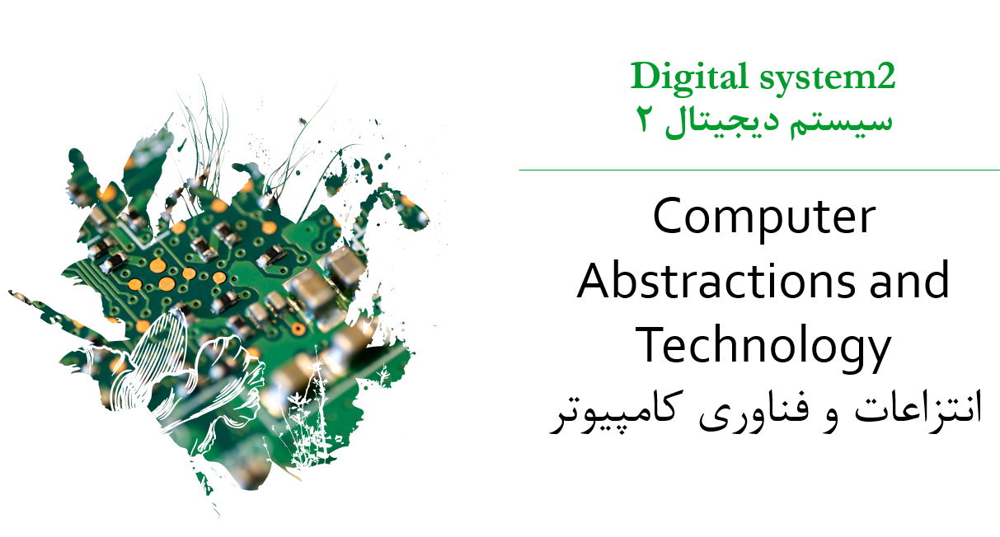
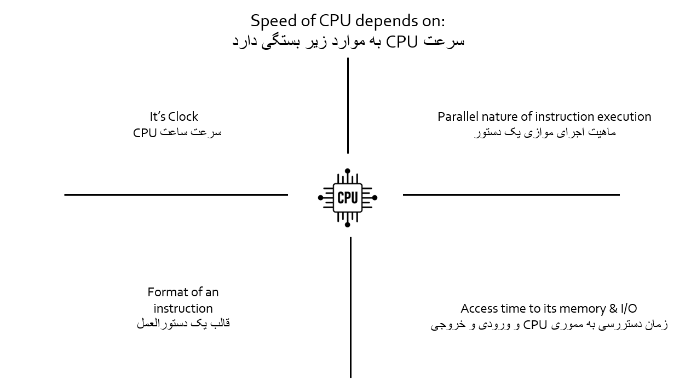
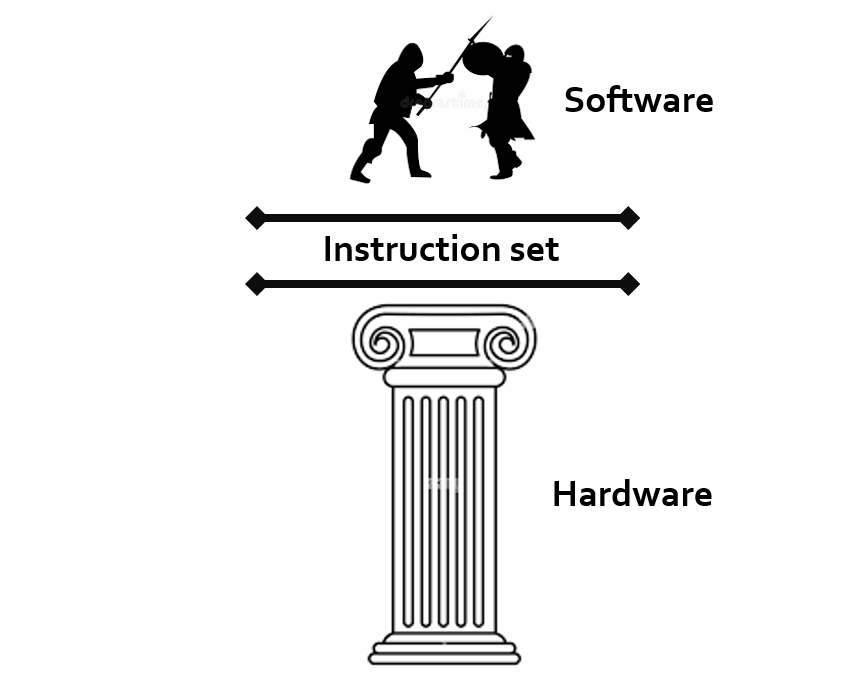
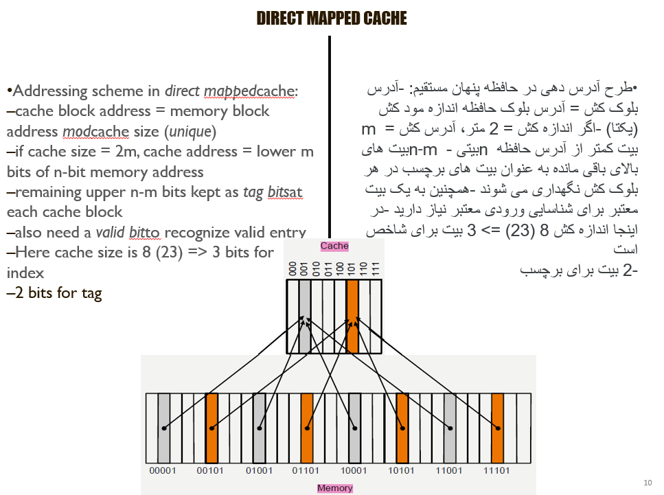
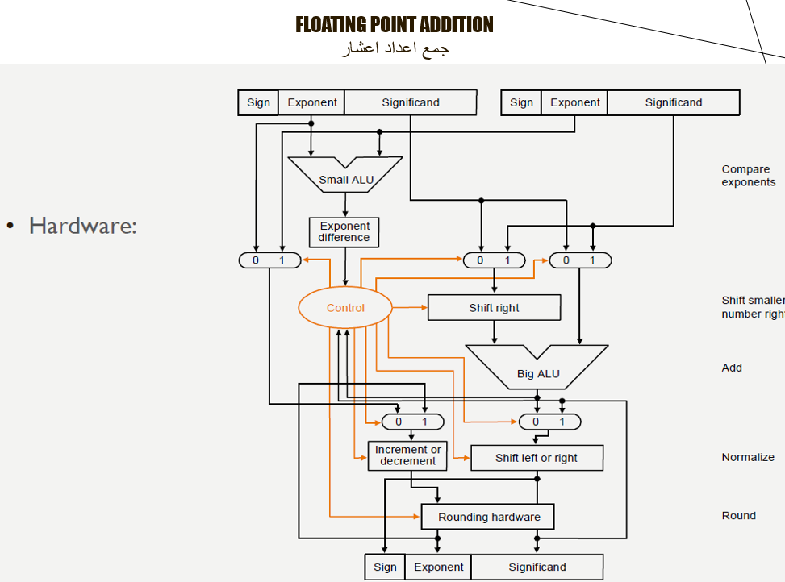
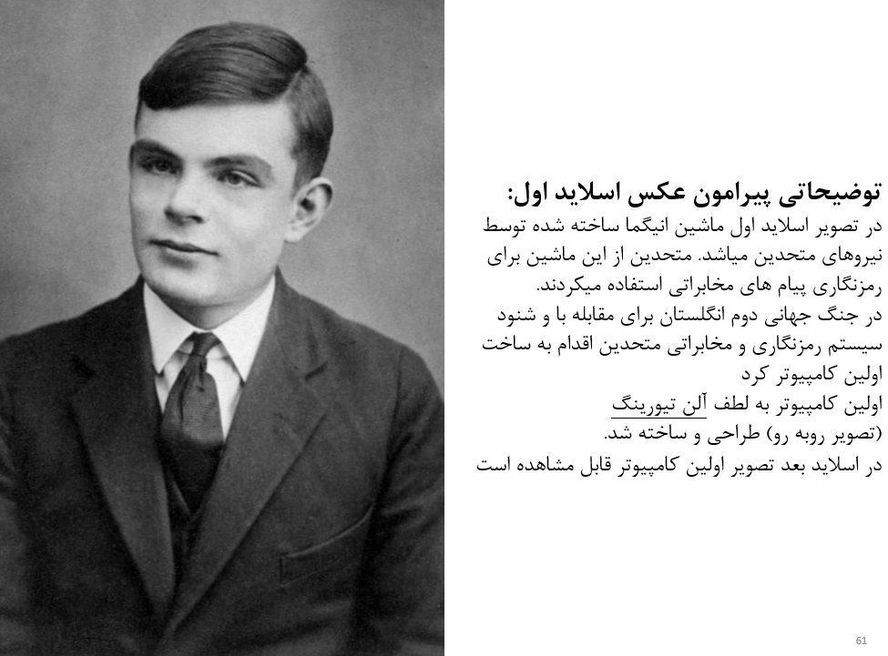
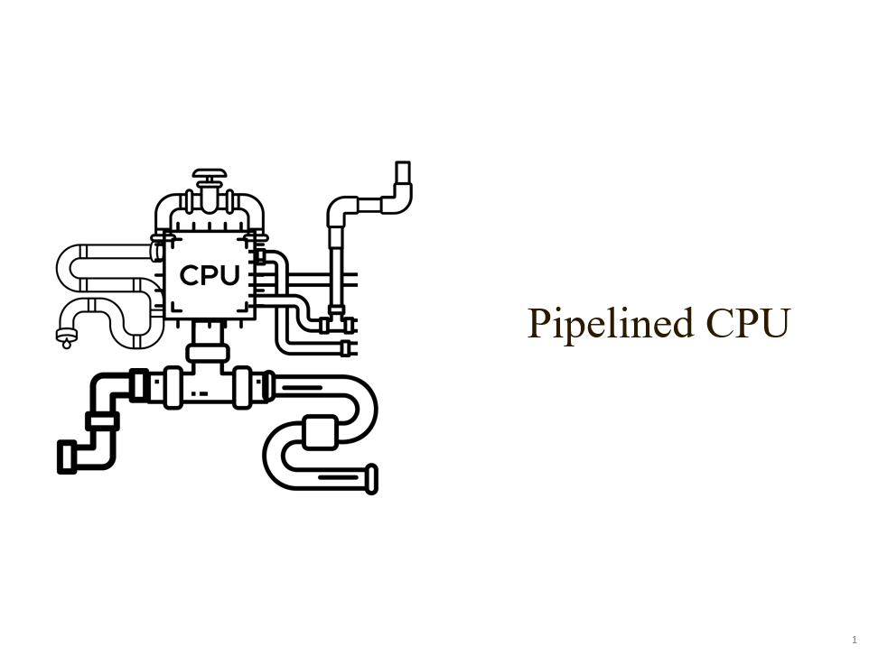
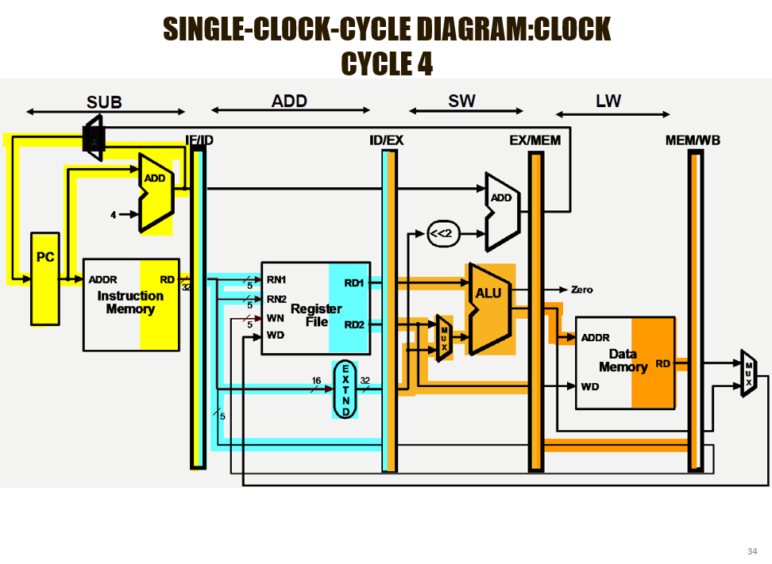
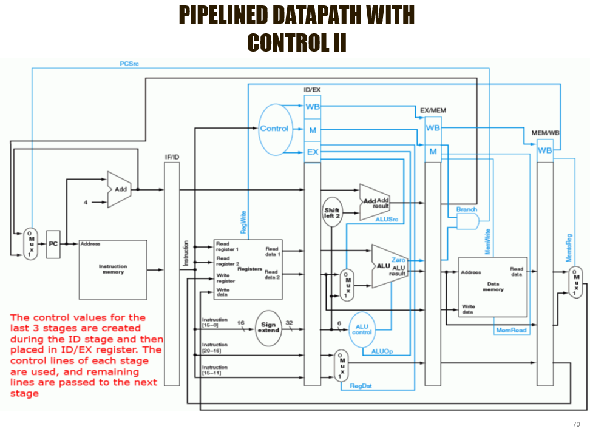

# Computer architecture

this power point is in English and also translated to Farsi at the same time.
so feel free to use it to prepare for your exam.presention etc ...
here are some picture of how the slides are look like.

# Table of content
- Chapter1.intro
- Chapter2.MIPS
- Chapter3.performance
- Chapter4.Memory Hirearchy
- Chapter5.Arithmetic For Computers
- Chapter6.MIPS Instruction Execution
- Chpater6.1.Pipelined CPU
- Chpater7.Exception And Interrupts
- [LICENSE](#LICENSE)

## Sample of Power Point

## License

Ponisha-position-finder is released under the terms of the MIT license. See [LICENSE](LICENSE.md) for more
information or see https://opensource.org/licenses/MIT.